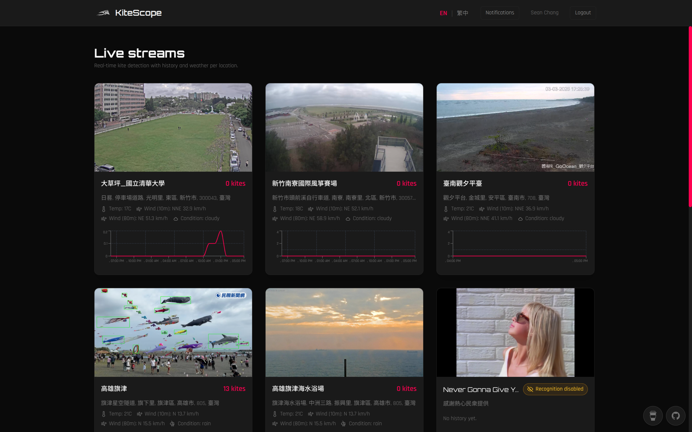
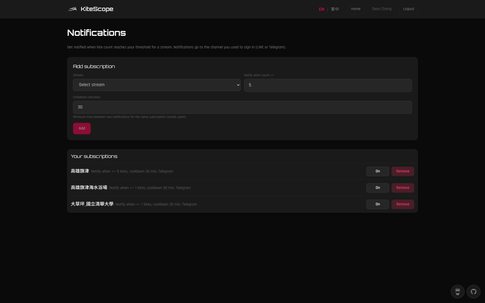
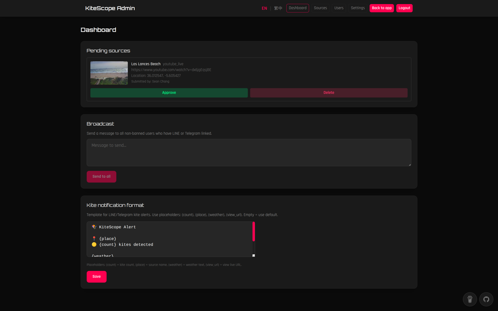
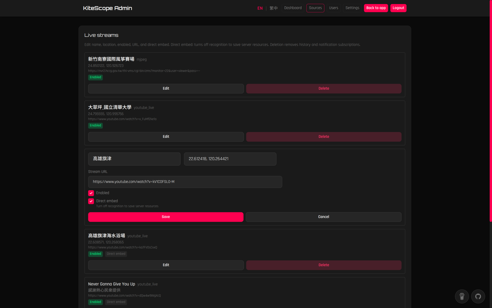

<p align="right"><a href="README.md">English</a></p>

<div align="center">

# KiteScope

**即時風箏監測：when2fly, where2fly.**

[](https://github.com/SeanChangX/KiteScope) [](https://opensource.org/licenses/MIT) [](https://kitescope.labxcloud.com)


<table>
<tr>
<td width="50%" align="center"><br><strong>儀表板</strong><br>串流卡片、即時計數、建議來源</td>
<td width="50%" align="center"><br><strong>通知設定</strong><br>依來源訂閱、門檻、頻道</td>
</tr>
<tr>
<td width="50%" align="center"><br><strong>管理 — 儀表板</strong><br>待審來源、廣播</td>
<td width="50%" align="center"><br><strong>管理 — 來源</strong><br>來源列表、管理串流</td>
</tr>
</table>

<br>

<div align="center">

[**功能**](#功能) &#8226;
[**開始使用**](#開始使用) &#8226;
[**串流來源**](#串流來源) &#8226;
[**偵測模型**](#偵測模型) &#8226;
[**通知**](#通知) &#8226;
[**開發**](#開發)

</div>

</div>

---

## 功能

每次想放風箏都要先看天氣、風向，大老遠跑到海邊，結果風又沒了？要是有人已經在放，代表一定可以放。KiteScope 會偵測各串流平臺的直播畫面、辨識風箏數量，當數量達到你設定的門檻，就透過 LINE 或 Telegram 通知你。

<p align="right">— 喜歡特技風箏的 robotics nerd，SCX</p>

---

## 開始使用

### 前置需求

- Docker 與 Docker Compose
- （選用）LINE Channel 與／或 Telegram Bot，用於登入與通知

### 使用 Docker 執行

1. 複製專案並進入目錄：
   ```bash
   git clone https://github.com/SeanChangX/KiteScope.git
   cd KiteScope
   ```

2. 複製範例 env 並視需要編輯：
   ```bash
   cp env.example .env
   ```

3. 啟動所有服務：
   ```bash
   docker compose up -d
   ```

4. **請先設定管理員密碼。** 開啟 **http://localhost:3000/admin**。若尚無管理員，會顯示設定表單：輸入使用者名稱與密碼後送出，再以該帳密登入。之後的來源、機器人、使用者等操作皆需先有管理員帳號。

5. 使用應用：
   - **http://localhost:3000** — 儀表板（串流與計數）、建議來源、歷史與通知設定連結。
   - **http://localhost:3000/login** — 使用 LINE 或 Telegram 登入。
   - **http://localhost:3000/notifications** — 管理你的通知訂閱（需先登入）。

---

## 系統架構

```
[ 瀏覽器 ] ---- [ 前端 ] ---- [ 後端 ]
                    |              |
                    |  驗證、資料庫、通知 worker
                    |
[ go2rtc ] ---- [ Vision：擷取 + 偵測 ] ---- 計數 + 畫面
```

Docker 執行四個服務：**frontend**（port 3000）、**backend**、**vision**、**go2rtc**。資料存放在單一 SQLite volume；偵測模型在獨立 volume 或透過管理後台上傳。

---

## 串流來源

來源由管理員新增（或從使用者建議審核通過）。提供網址與選填地點（用於通知中的天氣）；系統依網址自動辨識類型。

| 類型 | 說明 |
|------|------|
| **HTTP snapshot** | 單一圖片網址（JPEG/PNG）。 |
| **MJPEG** | MJPEG 串流網址。 |
| **RTSP** | `rtsp://` 網址。 |
| **go2rtc** | 在 go2rtc 中新增的串流（port 1984）。使用 go2rtc 的快照或串流網址。 |
| **YouTube Live** | `youtube.com`／`youtu.be` 直播網址。伺服器可能受 YouTube 限流。 |

憑證僅存於後端，不暴露給前端。

---

## 偵測模型

視覺服務需要偵測模型才能回報風箏計數；沒有模型時計數會維持 0。

- **CPU 路徑（預設）**：上傳 **ONNX** 模型，且 **class 0 為風箏**。
- **Coral Edge TPU（選用）**：上傳 **已編譯給 Edge TPU 使用的 TFLite 模型**。當選擇 `.tflite` 模型且偵測到 Coral TPU 時，推論會在 TPU 上執行。

在管理後台前往 **設定 → 偵測模型**：上傳模型檔（CPU 用 .onnx、Coral 用 .tflite），或將檔案放入 vision 模型 volume 後在該頁選擇。信心門檻等選項可在同頁設定。

若要查看完整的匯出、量化與 Coral 編譯流程，請參考 [`vision/scripts/README.md`](vision/scripts/README.md)。

### Coral Edge TPU（選用）

KiteScope 可將偵測工作 offload 到 Google Coral Edge TPU：

- **模型**：使用適用於 Edge TPU 的 YOLO 類模型，且 **class 0 為風箏**。
- **Docker 設定**（以 USB Coral 為例，vision 服務）：
  - 在 `docker-compose.yml`／`docker-compose.dev.yml` 中取消註解：
    - `- /dev/bus/usb:/dev/bus/usb`
- **環境變數**：
  - `DETECT_DEVICE=auto`（預設）：偵測到 Coral 即使用 TPU，否則用 CPU。
  - `DETECT_DEVICE=cpu`：強制使用 CPU ONNX 後端。
  - `DETECT_DEVICE=edgetpu`：強制使用 Coral（若無 TPU 則回退到 CPU）。

要確認目前實際使用的後端，可進入 **管理後台 → 儀表板**，查看 **System status** 卡片：會顯示偵測器是 **CPU (ONNX)** 還是 **Coral Edge TPU**，以及是否偵測到 TPU。

---

## 通知

使用者可針對每個來源訂閱：門檻、選填釋放門檻（遲滯）、頻道（LINE 或 Telegram）、冷卻時間。當平滑後的計數達到門檻並在釋放門檻以上維持時，會發送一則通知（計數、來源地點天氣、Telegram 上附快照）。LINE 與 Telegram 憑證在 **管理 → 設定 → Bot 設定** 中設定。管理員亦可從管理儀表板對全部或選定使用者發送一次性廣播。

---

## 開發

使用 dev Compose 進行本機開發（熱重載）：

```bash
docker compose -f docker-compose.dev.yml up
```

| 服務 | 網址 |
|------|------|
| Frontend | http://localhost:5173 |
| Backend | http://localhost:8000 |
| Vision | http://localhost:9000 |
| go2rtc | http://localhost:1984 |

前端 dev server 會將 `/api` 代理到後端。若要在本機測試 LINE 或 Telegram 登入，請用 tunnel（如 ngrok、cloudflared）暴露應用，並將 callback／網域設為該網址。

---

## License

[](https://opensource.org/licenses/MIT)

本專案採用 [MIT License](https://opensource.org/licenses/MIT)，詳見 [LICENSE](LICENSE) 檔案。

____
